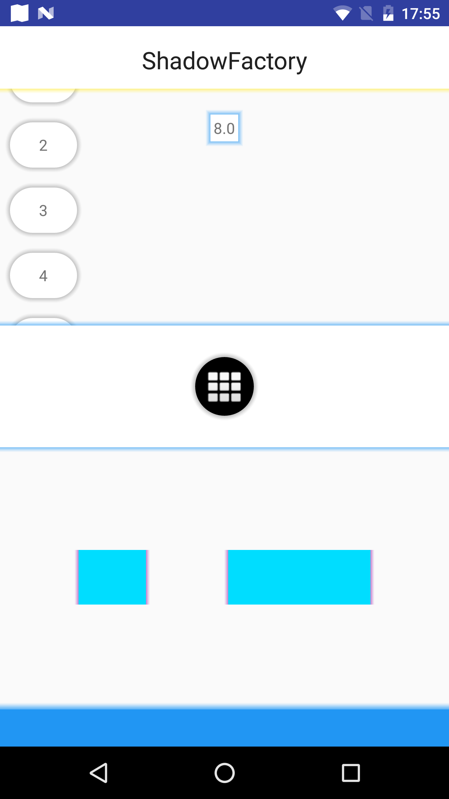

# ShadowFactory

Android library that lets add colorful "shadow like" background to Views

### Integration

you can add this Lib from [GitPack.io](https://jitpack.io/#yamin-elmakis/ShadowFactory)

Gradle:
Add GitPack in your root build.gradle

``` xml

allprojects {
    repositories {
        ...
        maven { url "https://jitpack.io" }
        }
    }

```
Then add the dependency

``` xml

dependencies {
    ...
    compile 'com.github.yamin-elmakis:ShadowFactory:v2'
}

```

### Usage

``` java
	Shadow.Builder.init(context)
		.shadowAll(shadowSize)
		.blur(blurSize)
		.backgroundColorRes(android.R.color.black)
		.shadowColorRes(R.color.grey)
		.build().set(view);
```

